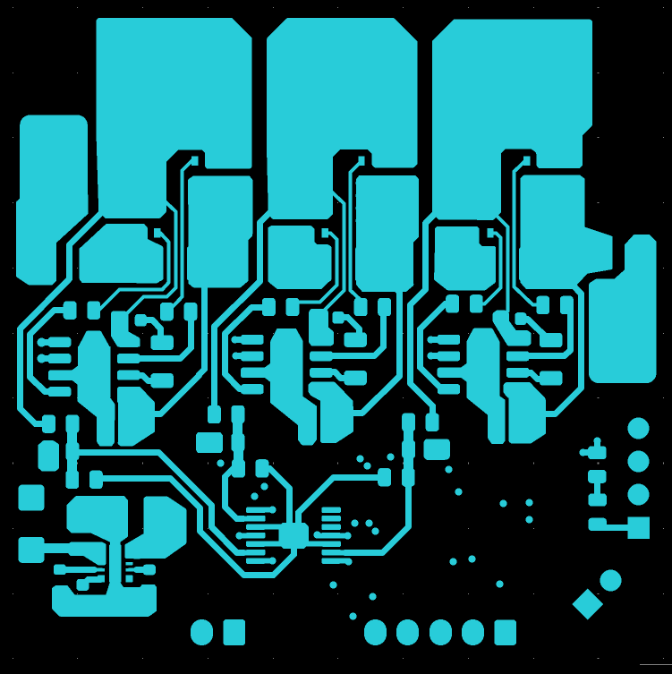
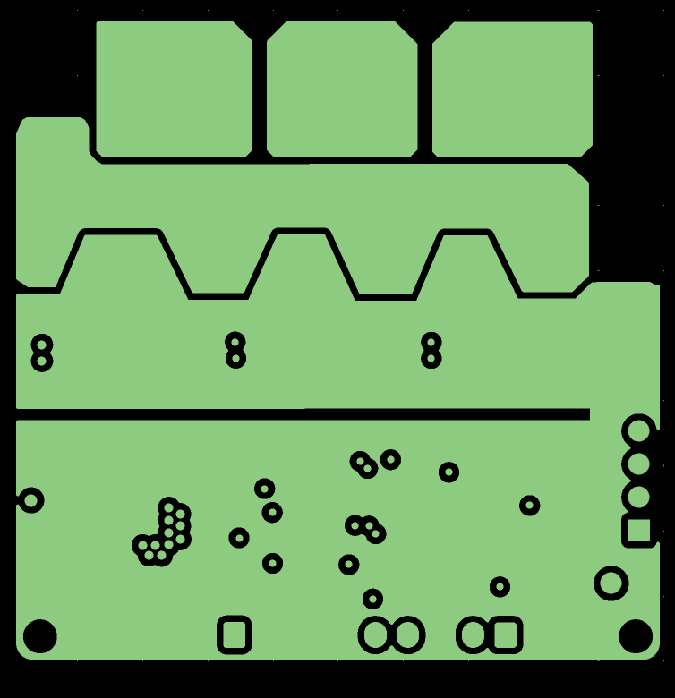
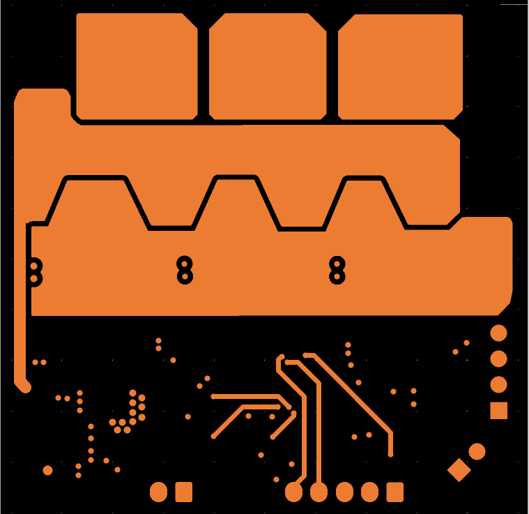
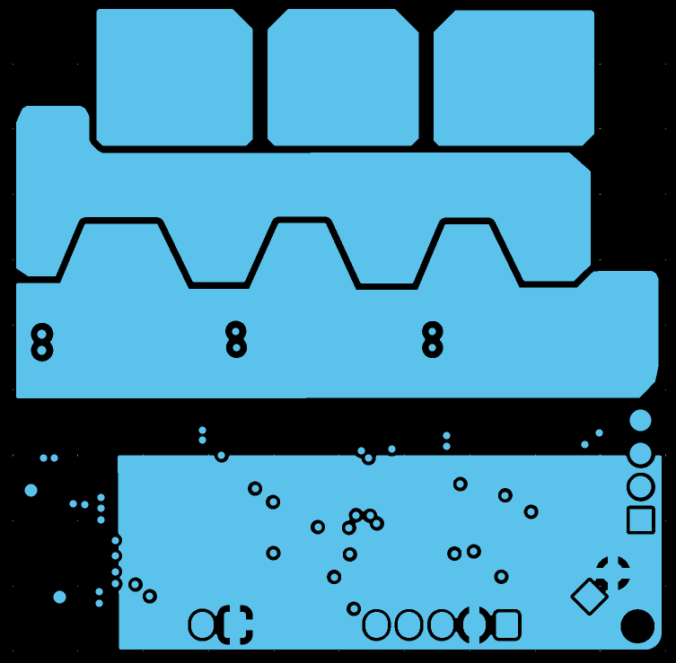
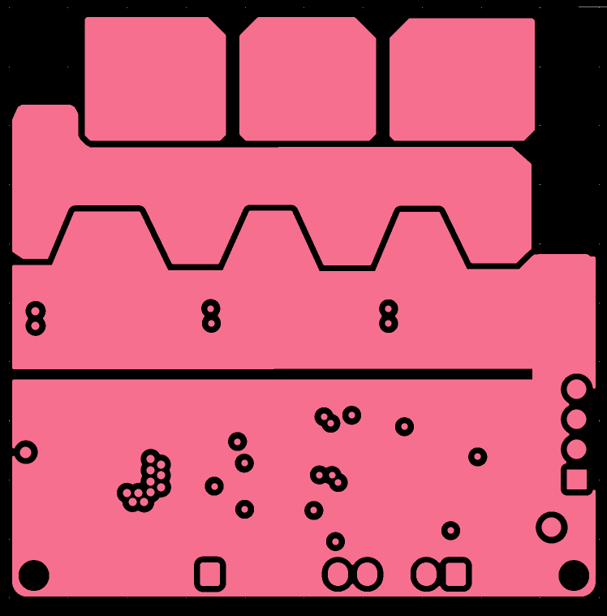
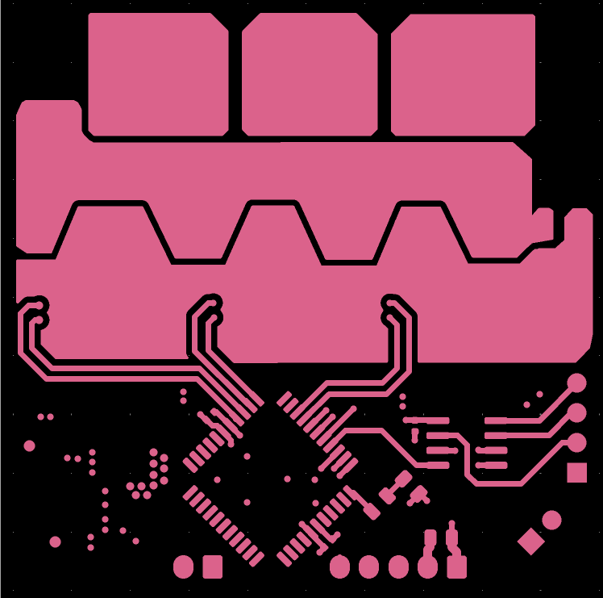

# Electronic Speed Controller (ESC)

Custom 3-phase sensorless BLDC ESC designed for high-performance RC applications.

---

## Overview

This ESC is built around a 50x50 mm **fully custom 6-layer PCB**, designed to handle high current loads while maintaining signal integrity for precise motor control.

It implements **sensorless commutation using BEMF detection**, enabling reliable operation without Hall sensors. The main goal of this ESC was to be as close as possible to what can be found on the market today. With the exception of the control logic using a digital potentiometer instead of PWM signal to drive the motor I can say that I've managed to achieve that.

---

## Hardware Design

### Microcontroller

* **PIC18F4431**
  Dedicated motor control MCU with PWM modules optimized for 3-phase control. At the time of designing the ESC I was clueless regarding which MCU to use. I ended up with an ancient one 😂 which eventually managed to do the job but I would consider far better and far newer options in the future designs

---

### Motor Control & Feedback

* **X9C103 Digital Potentiometer**
  Used for control input

* **MCP6564 (Quad Comparator)**
  Used alongside voltage dividers for **Back-EMF (BEMF) zero-crossing detection**

---

### Power Stage

* **SIR626DP-T1-RE3 MOSFETs**
  Low Rds(on) MOSFETs for high current handling

* **NCV51511 Gate Drivers**
  Bootstrap high/low-side drivers for their compact package and efficient switching

---

### Power Supply

* **TPMS82903 Buck Converter**
* Cappable of outputting: 5V | 3A (15W)
  Powers:

  * Logic circuitry
  * Receiver

---

## PCB Design

* **6-layer PCB**
* Optimized for:

  * Power distribution
  * Thermal performance
  * Compact design

---

## PCB Layers

### Layer 1 (Top)

> The first layer prioritizes clean signal routing, minimizing unnecessary vias to maintain direct, efficient connections between components. The dominant copper polygons on this layer belong to the power phase section, which occupies the upper portion of the board.

### Layer 2

> From the second layer onward, the focus shifts heavily toward the power stages. A key distinction on this layer is the separation between the power ground and the logic ground planes, keeping the two domains isolated within the board.

### Layer 3

> This layer mirrors the power structure of layer two, with the exception that the logic ground is absent. Only the traces connecting the comparators to the microcontroller remain, alongside the power supply traces for the buck converter.
### Layer 4

> The power polygons from the previous layers are carried over here, with the addition of a logic power plane distributed to all relevant components.

### Layer 5

> An exact replica of layer two.

### Layer 6

> The final layer is dedicated primarily to the logic-side components. Given the compact board size (50×50 mm), placing components on the bottom side was necessary to meet density requirements. Also notable on this layer are the PWM traces running from the microcontroller to the gate drivers, which switch the MOSFETs and control the motor. In retrospect, routing these traces on an inner layer would have been preferable — the outer copper thickness is 35 µm compared to 17.5 µm on the inner layers, which leaves the outer power ground polygon with a heavier copper weight than intended. That said, no issues have been observed during testing so far.
---
## ⚙️ Firmware

The firmware is adapted from:
- [https://github.com/k-omura](https://github.com/k-omura/SensorlessBLDC_PIC18F1230)

Modified to:

* Match this hardware design
* Implement sensorless BLDC control
* Optimize for RC vehicle response

---

## Target BLDC Motor

* **3660 BLDC Motor**
* **4200KV**
* **4 poles**
* **Max RPM:** ~50,000\

---

## Notes

* Designed for RC car applications
* Focus on performance and efficiency
* Continuously improved and tested
