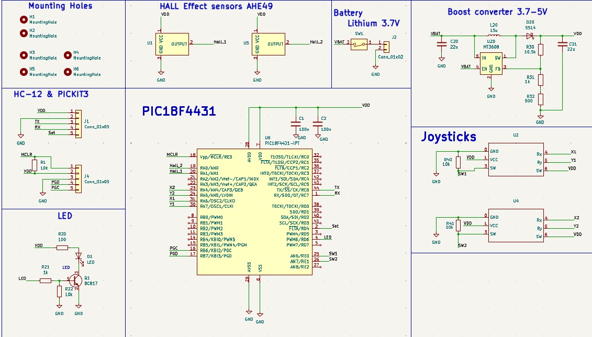
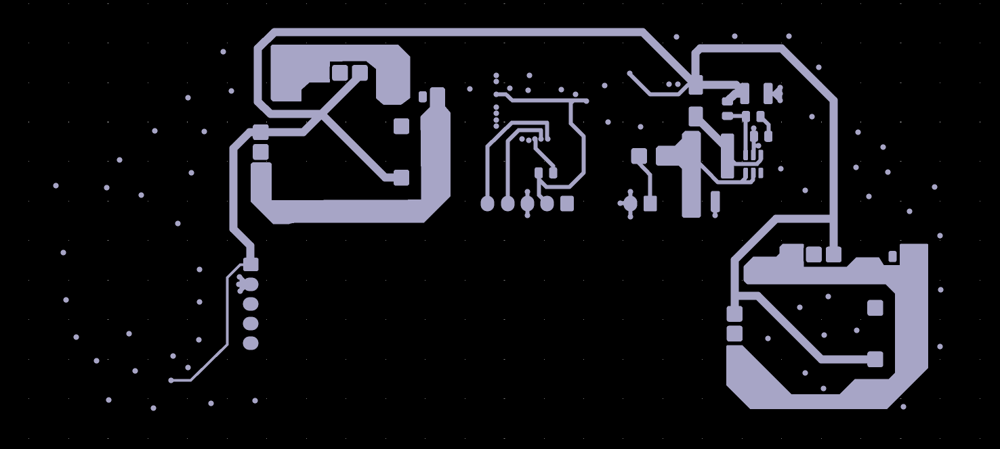
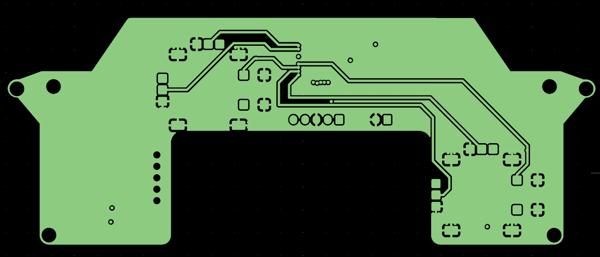
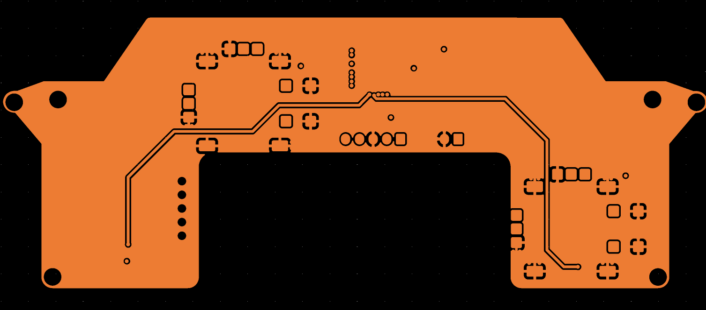
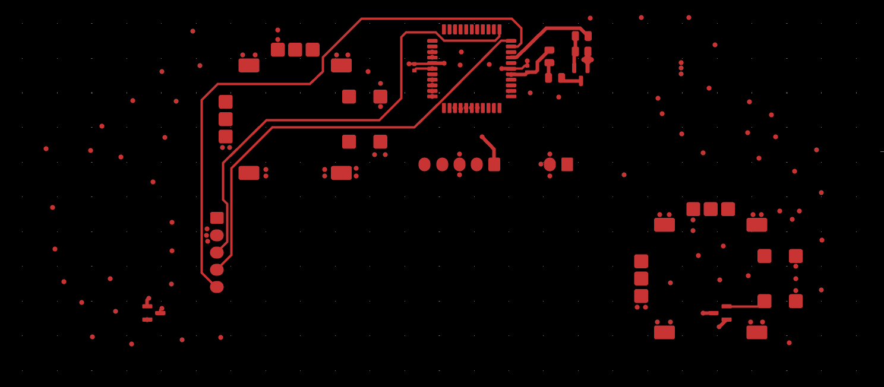

# Transmitter (Controller)

Custom handheld controller for wireless control of the RC vehicle.
I took down a worn down Xbox one controller, reused any parts that I could and remade my own PCB that fits inside the controller case so i can have a similar feel to the racing games I used to play and enojoy.

---

## 🧩 Overview

This transmitter is built around a **custom 4-layer PCB**, designed to provide precise and reliable user input for controlling the vehicle.

It captures joystick inputs and transmits control data wirelessly to the receiver.

---

## 🔌 Hardware Design

### 🧠 Microcontroller

* **PIC16F15276**
  Handles input processing and communication with the receiver.

---

### 🎛️ User Input

* **Dual Joysticks**
  Provide steering and throttle/brake control.

* **Hall Effect Sensors (from Xbox One controller)**
  Used for **high-precision, contactless throttle control**, improving reliability and eliminating mechanical wear.

---

## 📐 Schematic

> Replace this text with your explanation of the schematic:
>
> * how inputs are connected
> * power distribution
> * communication module connections
> * any filtering or protection used

---

## 🧱 PCB Design

* **4-layer PCB**
* Designed for:

  * Stable signal routing
  * Low noise input acquisition
  * Compact handheld form factor

---

## 🖼️ PCB Layers

### Layer 1

> Replace this with your explanation (component placement, routing strategy, etc.)

### Layer 2

> Replace this with your explanation

### Layer 3

> Replace this with your explanation

### Layer 4

> Replace this with your explanation

---

## ⚙️ Firmware

The firmware is responsible for:

* Reading joystick and sensor inputs
* Processing control signals
* Transmitting data wirelessly to the receiver

---

## 🎯 Functionality

* Real-time throttle and steering control
* Smooth input response using Hall effect sensing
* Reliable wireless communication

---

## 📌 Notes

* Designed specifically for RC applications
* Focus on precision and responsiveness
* Built using salvaged high-quality components (Xbox controller sensors)
